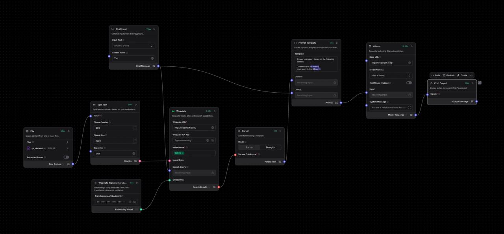
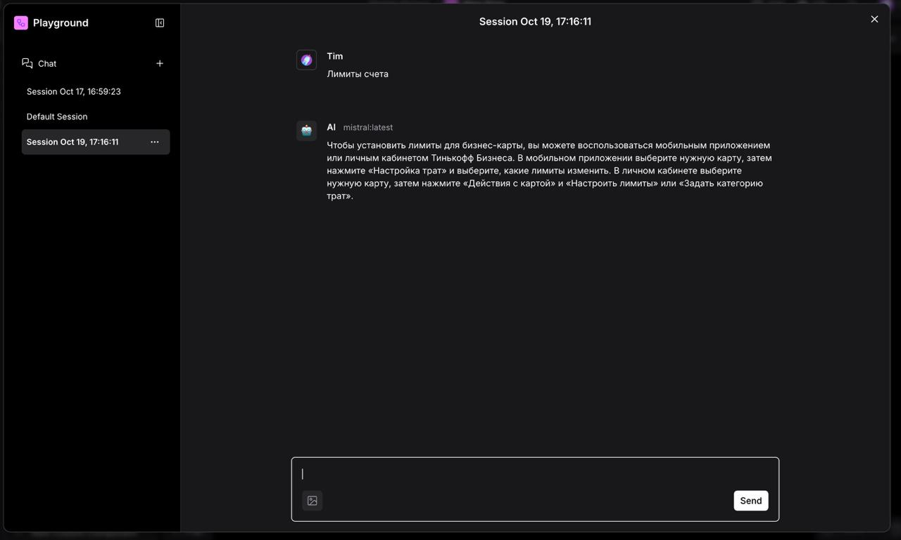

# BankRAG 🏦

A Retrieval-Augmented Generation (RAG) system built with Langflow, Weaviate, and transformers for banking customer support automation.
Main purpose of project were try Langflow.

## Features

- **Vector Database**: Weaviate for efficient similarity search
- **Embeddings**: [Sentence Transformers](https://github.com/weaviate/t2v-transformers-models) (multi-qa-MiniLM-L6-cos-v1) for text vectorization
- **RAG Pipeline**: Complete question-answering system with document retrieval
- **Containerized**: Docker Compose setup for easy deployment
- **Custom Components**: Langflow components for Weaviate and transformers integration

## Project Structure

```text
BankRAG/
├── data/                           # Dataset and training data
│   ├── qa_dataset.csv             # Q&A dataset
│   ├── qa_dataset.txt             # Formatted Q&A text
│   ├── train_our.jsonl           # Training data
│   └── data_gen.ipynb            # Data generation notebook
├── docker/                        # Docker configuration
│   ├── docker-compose.yml        # Multi-service setup
│   ├── Dockerfile                # Langflow container
│   └── docker.env               # Environment variables
├── flows/                         # Langflow workflows
│   └── Complete flow.json        # Main RAG flow
├── langflow_components/           # Custom Langflow components
│   ├── transformers_embedding_model_component.py
│   └── weaviate_server_component.py
├── test/                          # Testing and examples
│   ├── test.ipynb               # API testing notebook
│   └── res.json                 # Sample responses
└── requirements.txt              # Python dependencies
```

## Flow Structure



The Langflow workflow consists of interconnected components that handle document ingestion, embedding generation, vector storage, query processing, and response generation through a complete RAG pipeline.

## Installation & Setup

### Prerequisites

- Docker & Docker Compose
- Python 3.11+
- Git

### Quick Start

1. **Clone the repository**

   ```bash
   git clone https://github.com/RailSAB/BankRAG.git
   cd BankRAG
   ```

2. **Start all services**

   ```bash
   cd docker
   docker-compose up -d
   ```
  
   There are can occur problems with langlow in container. If so: run langflow manually by:

   ```bash
   pip install -r requirements.txt
   langflow run
   ```

3. **Access the interfaces**

   - **Langflow UI**: <http://localhost:7860>
   - **Weaviate**: <http://localhost:8080>
   - **Transformers API**: <http://localhost:8081>

## Services

### Weaviate (Vector Database)

- **Port**: 8080
- **Purpose**: Stores document embeddings for similarity search
- **Configuration**: Text2vec-transformers vectorizer

### Transformers Inference API

- **Port**: 8081
- **Model**: sentence-transformers-multi-qa-MiniLM-L6-cos-v1
- **Purpose**: Generates embeddings for text

### Langflow

- **Port**: 7860
- **Purpose**: RAG workflow orchestration
- **Credentials**: admin/admin123

## Usage



### API Endpoint

The main RAG system is accessible via the Langflow API:

```python
import requests
import uuid

url = "http://localhost:7860/api/v1/run/{FLOW_ID}"

payload = {
    "output_type": "chat",
    "input_type": "chat",
    "input_value": "Как посмотреть лимиты счета?",
    "session_id": str(uuid.uuid4())
}

headers = {
    "Content-Type": "application/json",
    "x-api-key": API_KEY
}

response = requests.post(url, json=payload, headers=headers)
result = response.json()
print(result)
```

### Direct Embedding API

Test the transformers service directly:

```bash
curl -X POST "http://localhost:8081/vectors" \
  -H "Content-Type: application/json" \
  -d '{"text": "Sample text for embedding"}'
```

## Further Development

### Container and Configuration Issues

- **Langflow Containerization Problems**: Resolve issues with Langflow container deployment and ensure stable operation within Docker Compose environment
- **Component Variable Configuration**: Fix environment variable passing and component configuration issues in containerized Langflow setup
- **Dependencies Management**: Address package installation and module import problems in the container environment

### API Integration Enhancement

- **Langflow API Data Retrieval**: Implement robust response parsing and error handling for Langflow API interactions
- **Response Format Standardization**: Create consistent data structures for API responses with proper error handling and validation
- **Session Management**: Improve session handling and conversation context management across API calls

### Telegram Bot Integration

- **Bot Framework Setup**: Integrate the RAG system with Telegram Bot API for user interactions
- **Message Processing Pipeline**: Implement message queuing and processing for handling multiple concurrent users
- **Rich Response Formatting**: Add support for formatted messages, buttons, and interactive elements in Telegram responses
- **User Session Management**: Implement user-specific conversation contexts and history tracking
